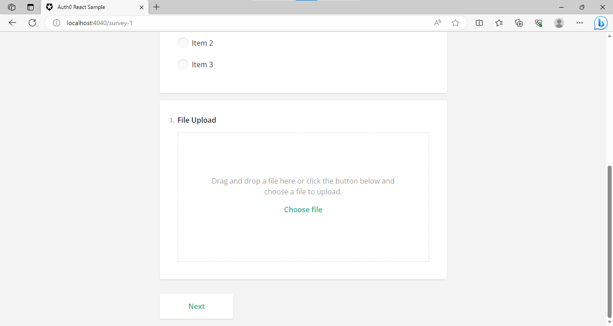
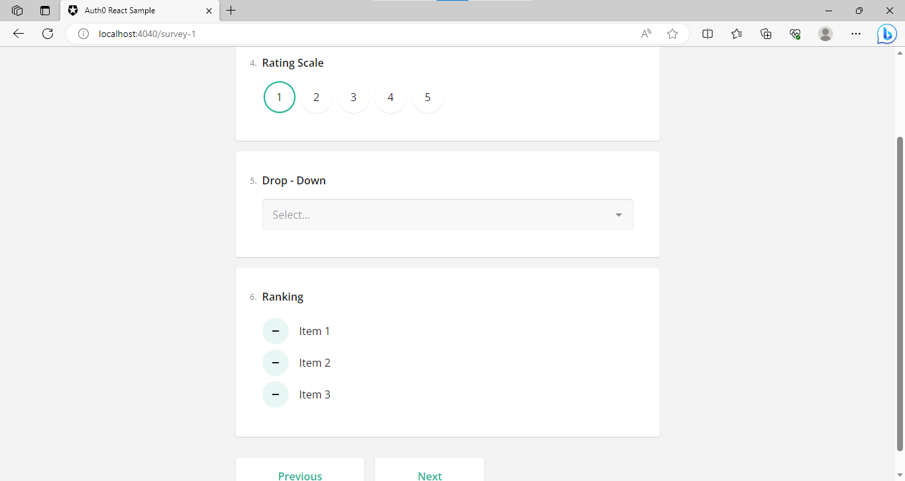

# Survey Application

A MERN stack Survey Application developed over Surveyjs  and Auth0 for User-Authentication 

## Table of Contents

- [Overview](#overview)
- [Getting Started](#getting-started)
  - [Prerequisites](#prerequisites)
  - [Installation](#Setup)
- [Usage](#usage)
- [Contributing](#contributing)
- [License](#license)

## Overview

The platform incorporates [User-Authentication], [Survey Management System] and [Real-time Updates].
Configurable Survey Style and automated flow management - SurveyJS 
User-Authentication - Auth0

## Prerequisites

Before you begin, ensure you have the following prerequisites installed:

- Node.js and npm (Node Package Manager)

## Usage

1. Install Dependencies

   ```sh
   npm install
   npm install cors body-parser
   npm install express
   npm install survey-react-ui
   npm start
   ```

2. Open your web browser and navigate to `http://localhost:4040`.

3. Click on the "Sign Up" button. (Log in if already signed up)

4. Check the credentials in Profile Page and policies in Company Portal. 

5. Navigate to the "Fill Survey" tab and proceed to particiapte in the survey. 

6. The collection of results in all the surveys participated by a user will be listed in "Surveys Participated tab".

7. Once submitted, the survey cannot be edited.

screenshot




---
